# UrbanLoco
### UrbanLoco: A Full Sensor Suite Dataset for Mapping and Localization in Urban Scenes

## Abstract
Mapping and localization is a critical module of autonomous driving, and significant achievements have been reached in this field. Beyond Global Navigation Satellite System (GNSS), research in point cloud registration, visual feature matching, and inertia navigation has greatly enhanced the accuracy and robustness of mapping and localization in different scenarios. However, highly urbanized scenes are still challenging: LIDAR- and camera-based methods perform poorly with numerous dynamic objects; the GNSS-based solutions experience signal loss and multipath problems; the inertia measurement units (IMU) suffer from drifting. Unfortunately, current public datasets either do not **adequately address this urban challenge or do not provide enough sensor information related to mapping and localization**. Here we present UrbanLoco: a mapping/localization dataset collected in highly-urbanized environments with a full sensor-suite. The dataset includes 13 trajectories collected in San Francisco and Hong Kong, covering a total length of over 40 kilometers. Our dataset includes a wide variety of urban terrains: urban canyons, bridges, tunnels, sharp turns, etc. More importantly, our dataset includes information from LIDAR, cameras, IMU, and GNSS receivers.   

Keywords: **Mpapping**, **Localization**, **Urban Areas**, **Full Sensor Suit**, **Hong Kong**, **San Francisco**

<p align="center">
  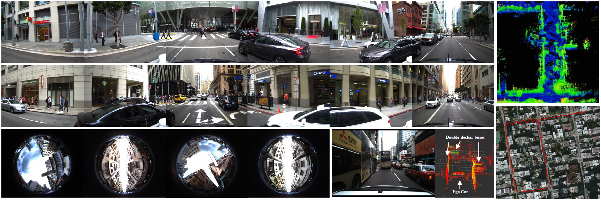
</p>

**Important Notes**: 
  - **Algorithm Benchmark and contribution**: Researches are welcomed to share their navigation solution results, source code to the UrbanLoco dataset after a code review process, e,g, code for visual/interial navigation system or LiDAR SLAM, etc. 

**Contact Authors**: 

- [Yiyang Zhou](https://www.linkedin.com/in/yiyang-zhou-67b47074) from the [Mechanical System Control Laboratory](https://msc.berkeley.edu/people/students.html), The University of California, Berkeley
- [Weisong Wen](https://weisongwen.wixsite.com/weisongwen) from the [Intelligent Positioning and Navigation Laboratory](https://www.polyu-ipn-lab.com/), The Hong Kong Polytechnique University. 

**Related Papers :** 
  - Weisong Wen, Yiyang Zhou, Guohao Zhang, Saman Fahandezh-Saadi, Xiwei Bai, Wei Zhan, Masayoshi Tomizuka, and Li-Ta Hsu, **UrbanLoco: A Full Sensor Suite Dataset for Mapping and Localization in Urban Scenes**, ICRA 2020, Paris, France.

*if you use UrbanLoco for your academic research, please cite our paper.*

**Work related to urbanLoco Dataset :** 
  - Liu, Jinxu, Wei Gao, and Zhanyi Hu. "Optimization-Based Visual-Inertial SLAM Tightly Coupled with Raw GNSS Measurements." arXiv preprint arXiv:2010.11675 (2020).[paper](https://arxiv.org/pdf/2010.11675.pdf)
  - Li, Kailai, Meng Li, and Uwe D. Hanebeck. "Towards high-performance solid-state-lidar-inertial odometry and mapping." arXiv preprint arXiv:2010.13150 (2020). [Code](https://github.com/KIT-ISAS/lili-om)

## 1. California Dataset
### 1.1 **Sensor Setups**
The platform for data collection in Hong Kong is a Honda Fit. The platform is equipped with the following sensors:
  - 3D LiDAR snesor ([RS-LiDAR-32, Robosense](https://www.robosense.ai/rslidar/rs-lidar-32)): ( 360 HFOV, +15~-25 VFOV, 200m range, 10Hz) 
  - IMU ([Xsens Mti 10](https://www.xsens.com/products/mti-10-series), 100 Hz, AHRS)
  - GNSS receiver: u-blox M8T or u-blox F9P (**to be updated**)  
  - camera x 6:(1920X1200,79.4°X96.8°, 10Hz) 
  - [SPAN-CPT](https://www.novatel.com/products/span-gnss-inertial-systems/span-combined-systems/span-cpt/):(RTK GNSS/INS,RMSE: 5cm, 1Hz) 

<p align="center">
  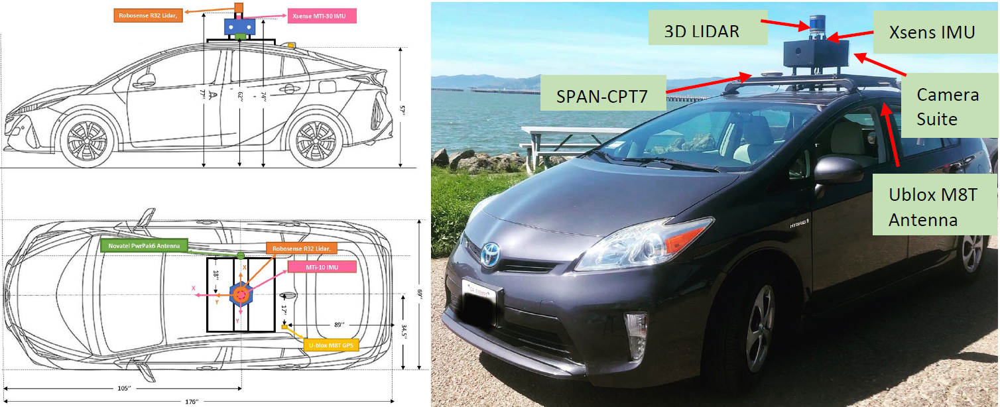
</p>

### **Intrinsic and Extrinsic Parameters**, **ROSBAG Information**

The coordinates transformation between multiple sensors, and intrinsic parameters of camera can be found via [Intrinsic and Extrinsic Parameters](calibration_CA/calibration_CA.txt).

- ROSBAG file which includes:
  - GNSS positioning (solution directly from GNSS receiver): ```/ublox_node/fix```
  - 3D LiDAR point clouds: ```/rslidar_points```
  - Camera: 
    - camera 0: ```camera_array/cam0/image_raw/compressed```
    - camera 1: ```camera_array/cam1/image_raw/compressed```
    - camera 2: ```camera_array/cam2/image_raw/compressed```
    - camera 3: ```camera_array/cam3/image_raw/compressed```
    - camera 4: ```camera_array/cam4/image_raw/compressed```
    - camera 5: ```camera_array/cam5/image_raw/compressed```
  - IMU: ```/imu_raw```
  - SPAN-CPT: ```/novatel_data/inspvax```

### 1.2. Dataset 1: CABayBridge20190828151211
**Brief**: Dataset CABayBridge20190828151211 is collected near Bay Bridge of San Francisco. 

**Some key features are as follows**:
  | Date of Collection | Total Size |Sensors |Download |Features |
  | :---:  | :---:  |:---:  |:---:  |:---:  |
  | 2019/08/28 | 44.6 GB|GNSS/LiDAR/Camera/IMU/SPAN-CPT |[Dropbox](https://www.dropbox.com/scl/fo/zrsmoddbq96t4go1wbxwp/AJw_DGVXng06DmLx9j9iQMs?rlkey=rk11n8tt62ejbg8mbixrm6quz&e=1&st=j7sy3izj&dl=0)[Baidu](https://pan.baidu.com/s/1-5d8xM1tzfsSSueTiU6-MQ?pwd=sufc)|Dynamic Objects, Sharp Turn|
  
  <!-- |  |  | | | |
  | **GNSS** | **IMU** |**LiDAR** |**Camera** | **Ground Truth**|
  | ```/ublox_gps_node/fix``` | ```/imu_raw``` |```/rslidar_points``` |```/camera_array/cam0/image_raw/compressed``` | ``/novatel_data/bestpos``| -->

<!-- **Rostopic for camera**: we provide camera images from six cameras with rostopic name from ```/camera_array/cam0/image_raw/compressed``` to ```/camera_array/cam5/image_raw/compressed``` -->

<p align="center">
  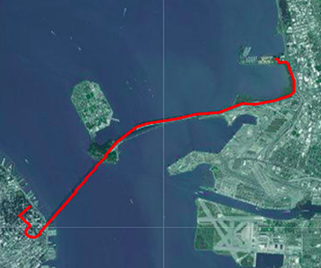
</p>

### 1.3. Dataset 2: CAMarketStreet20190828155828
**Brief**: Dataset CAMarketStreet20190828155828 is collected near market street of San Francisco. 

**Some key features are as follows**:
  | Date of Collection | Total Size |Sensors |Download |Features |
  | :---:  | :---:  |:---:  |:---:  |:---:  |
  | 2019/08/28 | 60.6 GB|GNSS/LiDAR/Camera/IMU/SPAN-CPT |[Dropbox](https://www.dropbox.com/scl/fo/zrsmoddbq96t4go1wbxwp/AJw_DGVXng06DmLx9j9iQMs?rlkey=rk11n8tt62ejbg8mbixrm6quz&e=1&st=j7sy3izj&dl=0)[Baidu](https://pan.baidu.com/s/1-5d8xM1tzfsSSueTiU6-MQ?pwd=sufc) |Dynamic Objects, high-rising buildings|

<p align="center">
  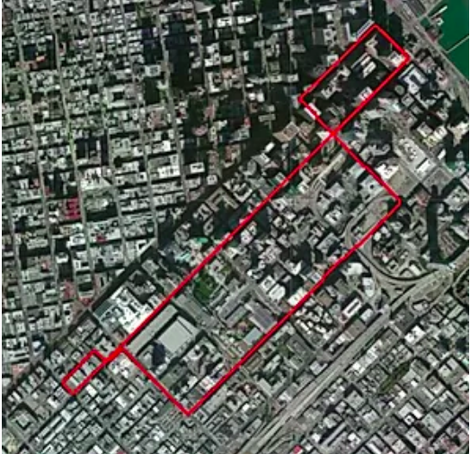
</p>

### 1.4. Dataset 3: CARussianHill20190828173350
**Brief**: Dataset CARussianHill20190828173350 is collected near Bay Bridge of San Francisco. 

**Some key features are as follows**:
  | Date of Collection | Total Size |Sensors |Download |Features |
  | :---:  | :---:  |:---:  |:---:  |:---:  |
  | 2019/08/28 | 67.2 GB|GNSS/LiDAR/Camera/IMU/SPAN-CPT |[Dropbox](https://www.dropbox.com/scl/fo/zrsmoddbq96t4go1wbxwp/AJw_DGVXng06DmLx9j9iQMs?rlkey=rk11n8tt62ejbg8mbixrm6quz&e=1&st=j7sy3izj&dl=0)[Baidu](https://pan.baidu.com/s/1-5d8xM1tzfsSSueTiU6-MQ?pwd=sufc) |Dynamic Objects, high-rising buildings|

<p align="center">
  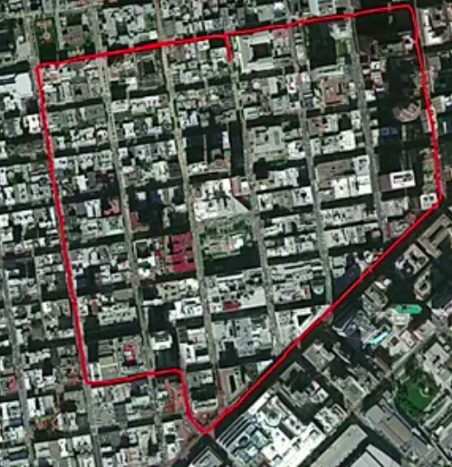
</p>

### 1.5. Dataset 4: CAChinaTown20190828180248
**Brief**: Dataset CAChinaTown20190828180248 is collected near a China Town of San Francisco. 

**Some key features are as follows**:
  | Date of Collection | Total Size |Sensors |Download |Features |
  | :---:  | :---:  |:---:  |:---:  |:---:  |
  | 2019/08/28 | 54.3 GB|GNSS/LiDAR/Camera/IMU/SPAN-CPT |[Dropbox](https://www.dropbox.com/scl/fo/zrsmoddbq96t4go1wbxwp/AJw_DGVXng06DmLx9j9iQMs?rlkey=rk11n8tt62ejbg8mbixrm6quz&e=1&st=j7sy3izj&dl=0)[Baidu](https://pan.baidu.com/s/1-5d8xM1tzfsSSueTiU6-MQ?pwd=sufc) |Dynamic Objects, high-rising buildings|

<p align="center">
  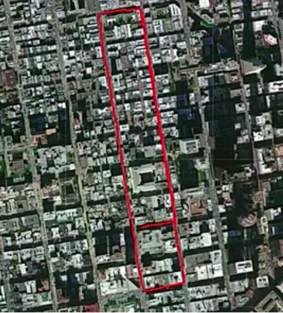
</p>

### 1.6. Dataset 5: CAColiTower20190828184706
**Brief**: Dataset CAColiTower20190828184706 is collected near Coli Tower of San Francisco. 

**Some key features are as follows**:
  | Date of Collection | Total Size |Sensors |Download |Features |
  | :---:  | :---:  |:---:  |:---:  |:---:  |
  | 2019/08/28 | 9.73 GB|GNSS/LiDAR/Camera/IMU/SPAN-CPT |[Dropbox](https://www.dropbox.com/scl/fo/zrsmoddbq96t4go1wbxwp/AJw_DGVXng06DmLx9j9iQMs?rlkey=rk11n8tt62ejbg8mbixrm6quz&e=1&st=j7sy3izj&dl=0)[Baidu](https://pan.baidu.com/s/1-5d8xM1tzfsSSueTiU6-MQ?pwd=sufc) |Dynamic Objects, high-rising buildings|

<p align="center">
  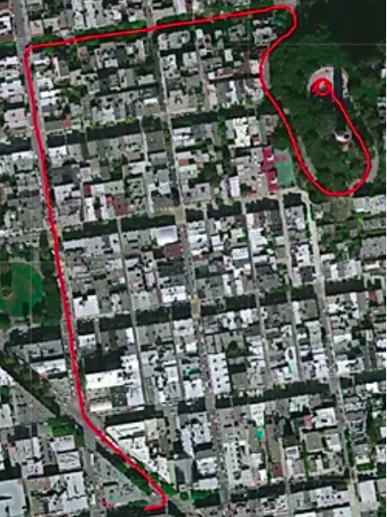
</p>

### 1.7. Dataset 6: CALombardStreet20190828190411
**Brief**: Dataset CALombardStreet20190828190411 is collected near Lombard street of San Francisco. 

**Some key features are as follows**:
  | Date of Collection | Total Size |Sensors |Download |Features |
  | :---:  | :---:  |:---:  |:---:  |:---:  |
  | 2019/08/28 | 9.83 GB|GNSS/LiDAR/Camera/IMU/SPAN-CPT |[Dropbox](https://www.dropbox.com/scl/fo/zrsmoddbq96t4go1wbxwp/AJw_DGVXng06DmLx9j9iQMs?rlkey=rk11n8tt62ejbg8mbixrm6quz&e=1&st=j7sy3izj&dl=0)[Baidu](https://pan.baidu.com/s/1-5d8xM1tzfsSSueTiU6-MQ?pwd=sufc) |Dynamic Objects, high-rising buildings|

<p align="center">
  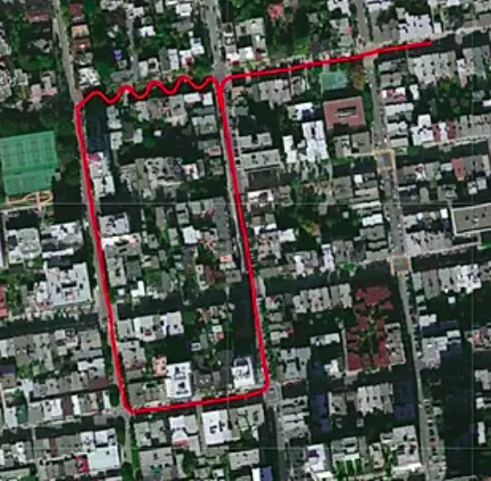
</p>

### 1.8. Dataset 7: CAGoldenBridge20190828191451
**Brief**: Dataset CAGoldenBridge20190828191451 is collected near Golden Bridge of San Francisco. 

**Some key features are as follows**:
  | Date of Collection | Total Size |Sensors |Download |Features |
  | :---:  | :---:  |:---:  |:---:  |:---:  |
  | 2019/08/28 | 40.1 GB|GNSS/LiDAR/Camera/IMU/SPAN-CPT |[Dropbox](https://www.dropbox.com/scl/fo/zrsmoddbq96t4go1wbxwp/AJw_DGVXng06DmLx9j9iQMs?rlkey=rk11n8tt62ejbg8mbixrm6quz&e=1&st=j7sy3izj&dl=0)[Baidu](https://pan.baidu.com/s/1-5d8xM1tzfsSSueTiU6-MQ?pwd=sufc) |Dynamic Objects, high-speed dataset|

<p align="center">
  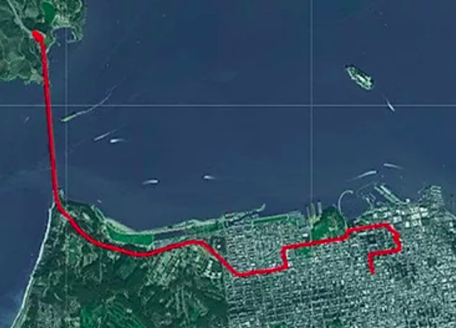
</p>


## 2. Hong Kong Dataset
### 2.1 **Sensor Setups**
The platform for data collection in Hong Kong is a Honda Fit. The platform is equipped with the following sensors:
  - 3D LiDAR snesor ([HDL 32E Velodyne](https://velodynelidar.com/products/hdl-32e/)): (360 HFOV, +10~-30 VFOV, 80m range, 10Hz) 
  - IMU ([Xsens Mti 10](https://www.xsens.com/products/mti-10-series), 100 Hz, AHRS)
  - GNSS receiver: u-blox M8T or u-blox F9P (**to be updated**)  
  - camera:(1920X1200,79.4°X96.8°, 10Hz) 
  - [SPAN-CPT](https://www.novatel.com/products/span-gnss-inertial-systems/span-combined-systems/span-cpt/):(RTK GNSS/INS,RMSE: 5cm, 1Hz) 

<p align="center">
  
</p>

### **Intrinsic and Extrinsic Parameters**, **ROSBAG Information**
The coordinates transformation between multiple sensors, and intrinsic measurements of camera can be found via [Extrinsic Parameters](calibration_HK/extrinsic.yaml) and [Intrinsic Parameters of Camera](calibration_HK/camera_intrinsic.yaml). The fish-eye camera intrinsic parameters can be found through [here](calibration_HK/Fisheye_camera_intrinsic.yaml).

- ROSBAG file which includes:
  - GNSS positioning (solution directly from GNSS receiver): ```/ublox_node/fix```
      - 3D LiDAR point clouds: ```/velodyne_points```
      - Camera: ```/camera/image_color```
      - IMU: ```/imu/data```
      - SPAN-CPT: ```/novatel_data/inspvax```
Note that majority Hong Kong data is provided in ROS2 format.
### 2.2. Dataset 1: HK-Data20190426-2
**Brief**: Dataset HK-Data20190426-2 is collected near Whampooa of Hong Kong. 

**Some key features are as follows**:
  | Date of Collection | Total Size |Sensors |Download |Features |
  | :---:  | :---:  |:---:  |:---:  |:---:  |
  | 2019/04/26 | 41.6 GB|GNSS/LiDAR/Fish-eye Camera/IMU/SPAN-CPT |[Dropbox](https://www.dropbox.com/scl/fo/zrsmoddbq96t4go1wbxwp/AJw_DGVXng06DmLx9j9iQMs?rlkey=rk11n8tt62ejbg8mbixrm6quz&e=1&st=j7sy3izj&dl=0)[Baidu](https://pan.baidu.com/s/1-5d8xM1tzfsSSueTiU6-MQ?pwd=sufc) |Dynamic Objects, Tall buildings |

<p align="center">
  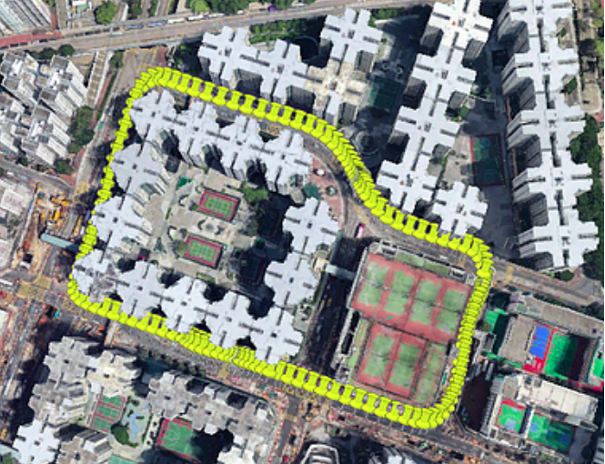
</p>

### 2.3. Dataset 2: HK-Data20190426-1
**Brief**: Dataset HK-Data20190426-1 is collected near Ma Tau Kok of Hong Kong. 

**Some key features are as follows**:
  | Date of Collection | Total Size |Sensors |Download |Features |
  | :---:  | :---:  |:---:  |:---:  |:---:  |
  | 2019/04/26 | 24.0 GB|GNSS/LiDAR/Fish-eye Camera/IMU/SPAN-CPT |[Dropbox](https://www.dropbox.com/scl/fo/zrsmoddbq96t4go1wbxwp/AJw_DGVXng06DmLx9j9iQMs?rlkey=rk11n8tt62ejbg8mbixrm6quz&e=1&st=j7sy3izj&dl=0)[Baidu](https://pan.baidu.com/s/1-5d8xM1tzfsSSueTiU6-MQ?pwd=sufc) |Poor GNSS visibilities, Very Tall buildings |

<p align="center">
  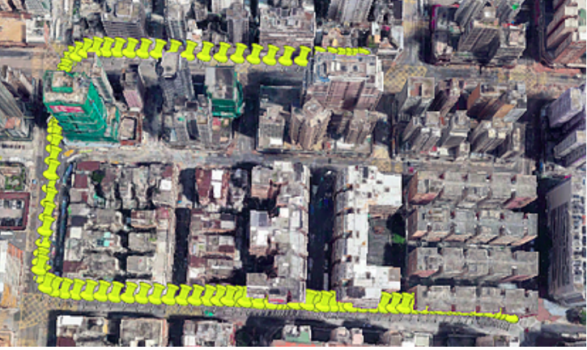
</p>

### 2.4. Dataset 3: HK-Data20190316-2
**Brief**: Dataset HK-Data20190316-2 is collected near Ma Tau Kok of Hong Kong. 

**Some key features are as follows**:
  | Date of Collection | Total Size |Sensors |Download |Features |
  | :---:  | :---:  |:---:  |:---:  |:---:  |
  | 2019/03/16 | 62.3 GB|GNSS/LiDAR/Fish-eye Camera/IMU/SPAN-CPT |[Dropbox](https://www.dropbox.com/scl/fo/zrsmoddbq96t4go1wbxwp/AJw_DGVXng06DmLx9j9iQMs?rlkey=rk11n8tt62ejbg8mbixrm6quz&e=1&st=j7sy3izj&dl=0)[Baidu](https://pan.baidu.com/s/1-5d8xM1tzfsSSueTiU6-MQ?pwd=sufc) |Poor GNSS visibilities, Very Tall buildings |

<p align="center">
  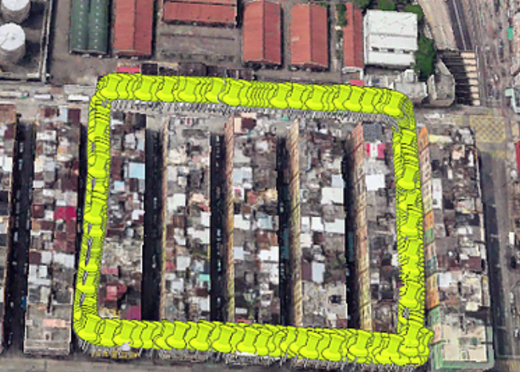
</p>

### 2.5. Dataset 4: HK-Data20190316-1
**Brief**: Dataset HK-Data20190316-1 is collected near Ma Tau Kok of Hong Kong. 

**Some key features are as follows**:
  | Date of Collection | Total Size |Sensors |Download |Features |
  | :---:  | :---:  |:---:  |:---:  |:---:  |
  | 2019/03/16 | 27.9 GB|GNSS/LiDAR/Fish-eye Camera/IMU/SPAN-CPT |[Dropbox](https://www.dropbox.com/scl/fo/zrsmoddbq96t4go1wbxwp/AJw_DGVXng06DmLx9j9iQMs?rlkey=rk11n8tt62ejbg8mbixrm6quz&e=1&st=j7sy3izj&dl=0)[Baidu](https://pan.baidu.com/s/1-5d8xM1tzfsSSueTiU6-MQ?pwd=sufc) |Poor GNSS visibilities, Very Tall buildings |

<p align="center">
  
</p>

### 2.6. Dataset 5: HK-Data20190117
**Brief**: Dataset HK-Data20190117 is collected near Ma Tau Kok of Hong Kong. 

**Some key features are as follows**:
  | Date of Collection | Total Size |Sensors |Download |Features |
  | :---:  | :---:  |:---:  |:---:  |:---:  |
  | 2019/03/16 | 6.11 GB|GNSS/LiDAR/Camera/IMU/SPAN-CPT |[Dropbox](https://www.dropbox.com/scl/fo/zrsmoddbq96t4go1wbxwp/AJw_DGVXng06DmLx9j9iQMs?rlkey=rk11n8tt62ejbg8mbixrm6quz&e=1&st=j7sy3izj&dl=0)[Baidu](https://pan.baidu.com/s/1-5d8xM1tzfsSSueTiU6-MQ?pwd=sufc) |decent GNSS visibilities, sub-urban |

<p align="center">
  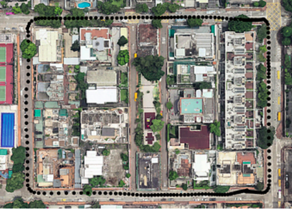
</p>

## 3. Easy Use Scripts

### 3.1 Extract ground truth and u-blox solution to .kml file
  - Build
  ```bash
  cd ~/catkin_ws/src
  git clone https://github.com/weisongwen/UrbanLoco
  cd ../
  catkin_make
  source ~/catkin_ws/devel/setup.bash
  ```
  - Usage
    - Install additional library
      ```
      sudo pip install pykml
      ```
    - spancpt2kml.py
      - run and save the trajectory of span-cpt to .kml file
        ```
        python spancpt2kml.py
        ```
    - ublox2kml.py
      - run and save the trajectory of u-blox to .kml file
        ```
        python ublox2kml.py
        ```
### 3.2 Extract the raw GNSS measurements from ```/ublox_node/...``` to RINEX file

Some researchers may want to apply the RTKLIB to process the GNSS data using the [RTKLIB](https://github.com/tomojitakasu/RTKLIB) which is mainly used in the GNSS field, we recommend to use one piece of code from [ublox2rinex](https://github.com/TakahashiJinxu/ublox2rinex) and [issue](https://github.com/weisongwen/UrbanLoco/issues/4).
## 3. Acknowledgements
The authors from Berkeley hereby thank the generous support of Robosense, whose donation of a Robosense R32 LIDAR is a critical step in our data acquisition process. We also thank Di Wang for his contributions on vehicle instrumentation at UC Berkeley.

## 4. License
This work is licensed under a Creative Commons Attribution-NonCommercial-ShareAlike 4.0 International License and is provided for non-commercial but academic use. If you are interested in using this dataset for commercial purposes, please contact us.
